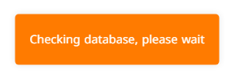
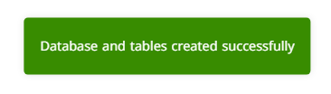
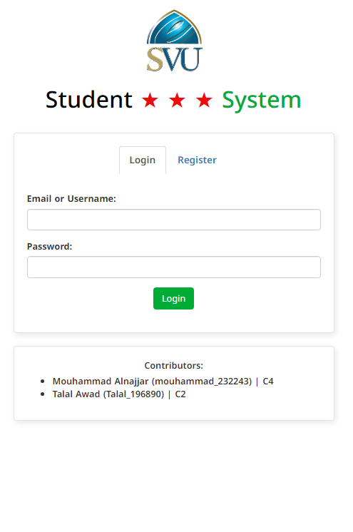
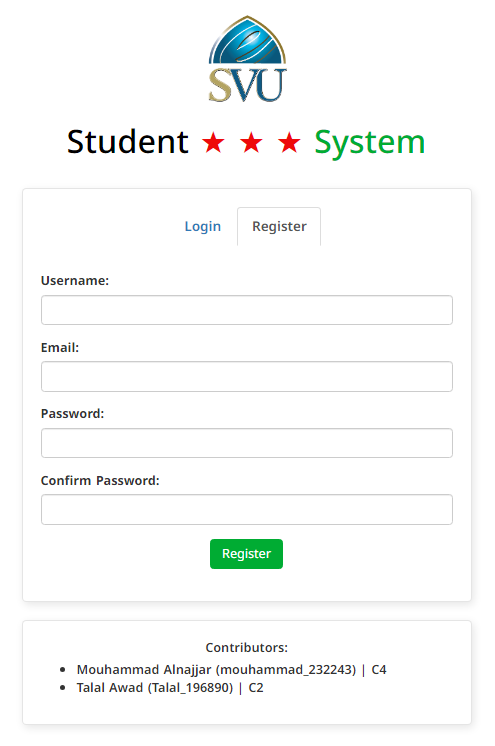
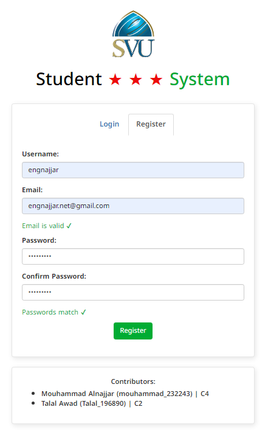
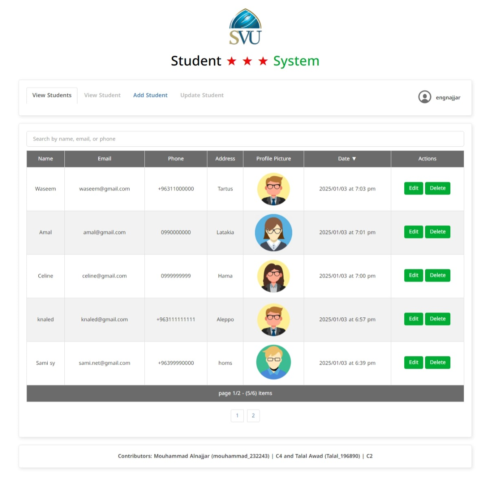
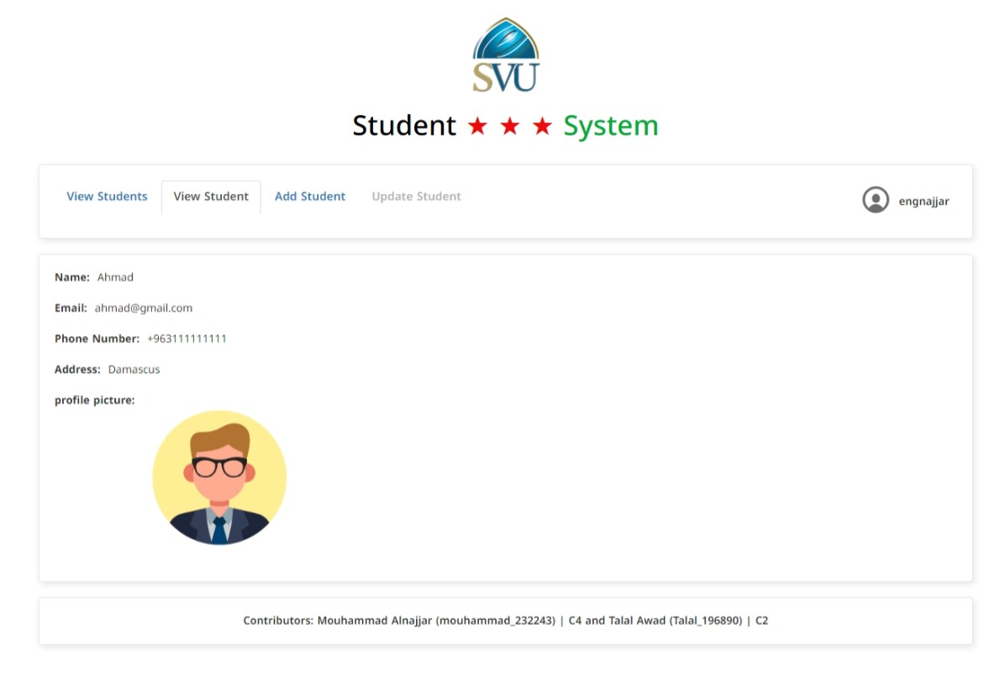
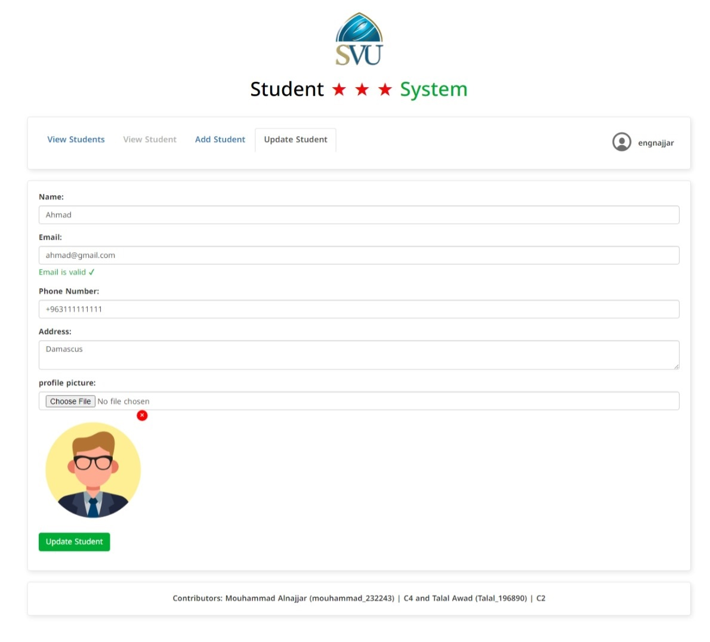
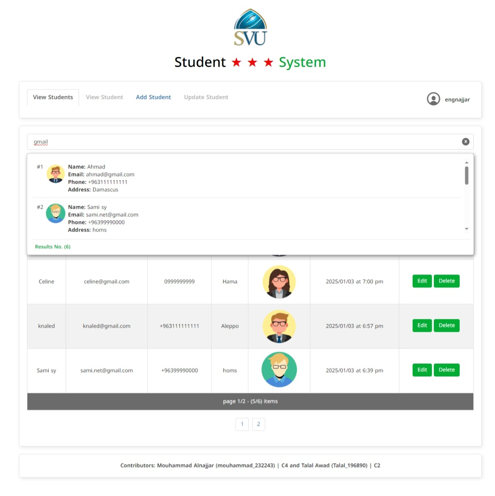
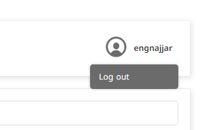

# [SVU Student System](https://svu-student-sys.free.nf/)

A dynamic student management web application.
( Web Programming II ITE_BWP501_S24 )

## Tutor

**Bassel Mustaffa Alkhatib**

## Contributors

-   **Mouhammad Alnajjar** (`mouhammad_232243`) | C4
-   **Talal Awad** (`Talal_196890`) | C2

## Description

The SVU Student System is a dynamic and responsive web application designed to manage student records efficiently. Built using HTML, CSS, JavaScript, Bootstrap, PHP, and MySQL, it offers core CRUD operations along with advanced features like user authentication, search functionality, pagination, and AJAX form validation.

## Features

1. File Uploads: Upload and store student profile pictures with database references.
2. Search Functionality: Filter students by name, email, or phone number.
3. Pagination: Display student records in pages (e.g., 10 per page).
4. AJAX Form Validation: Validate forms in real-time without page reloads.
5. Responsive Design: Optimized for both desktop and mobile devices using Bootstrap.

## Tech Stack

-   **Backend**: PHP 8.0+, MySQL 5.7+
-   **Frontend**: HTML, CSS, Bootstrap 5
-   **Interactivity**: jQuery 3.6.0, AJAX

## Installation

### 1. Set Up XAMPP

-   Install XAMPP on your system.
-   Launch XAMPP and activate the **Apache** and **MySQL** modules.

### 2. Project Setup

-   Extract the project files into a new folder, for example, `svu_std_sys`.
-   Place the folder in the following directory:  
    `C:\xampp\htdocs\svu_std_sys`.

### 3. Run the Application

-   Open your web browser and navigate to:  
    `http://localhost/svu_std_sys`.
-   The system will automatically check if the required database exists:
    -   If not, it will create the database and tables automatically.
-   Once completed, you will be redirected to the login/register page.
-   **Note:** If the database server hostname, username, or password differs from the default settings, update the config.php file with your own data:

```php
// Database server configuration
$servername = "localhost"; // Hostname of the database server
$username = "root";        // Username for the database
$password = "";            // Password for the database user
$dbname = "student_registration_system"; // Name of the database
```

## Dependencies

-   **Google Fonts**:

    -   Fonts: `Encode Sans Semi Condensed` and `Noto Kufi Arabic`
    -   Preconnect:
        -   `https://fonts.googleapis.com`
        -   `https://fonts.gstatic.com`

-   **Bootstrap**:

    -   CSS Framework: `assets/css/bootstrap.min.css`
    -   JavaScript Library: `assets/js/bootstrap.min.js`
    -   Download from: [Bootstrap Official Website](https://getbootstrap.com/)

-   **jQuery**:

    -   JavaScript Library: `assets/js/jquery-3.6.0.min.js`

## Screenshots






















## Hosting Service

The project is hosted on [InfinityFree](https://infinityfree.com/)
